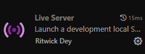

# 📋 **Descrição**
Desenvolvimento em JavaScript de uma aplicação que registra e armazena localmente os dados cadastrados pelo usuário, além de consultar e remover os usuários cadastrados.

# 🌟 **Funcionalidades**
- **Cadastro de usuário**
- **Consulta de usuário**
- **Remoção de usuário**

# 🛠️ **Tecnologias Utilizadas**
- **HTML**
- **JavaScript**
- **CSS**

# 📦 **Como utilizar o sistema**
1. Clone este repositório ou faça o download do projeto.
2. No **Visual Studio Code**, instale a extensão **Live Server**:
   - Pressione **Ctrl + Shift + X** para abrir a aba de extensões.
   - Pesquise por **Live Server** e instale a extensão.

        

3. Abra o arquivo `index.html` no VS Code:
   - Clique com o botão direito e selecione **Open With Live Server** ou pressione **Alt + L** seguido de **Alt + O** no teclado.
   - O sistema está pronto para uso.

4. Utilizando o sistema:
   - **Cadastrar usuário**: Preencha todos os campos e clique em **Cadastrar**.
   - **Consultar usuários**: Clique em **Consultar** para exibir a lista de usuários cadastrados.
   - **Remover usuário**: Clique no botão vermelho **Remover** ao lado do cadastro e confirme a exclusão na caixa de diálogo.

   - **Voltar ao cadastro**: Use o botão **Voltar ao Cadastro** para retornar à página inicial.

## 📁**Estrutura do Projeto**

```
.
├── assets/                              # Recursos estáticos (imagens, etc.)
├── src/                                 # Códigos da Aplicação
│   ├── index.js/                        # Lógica e interações da página (JavaScript)
│   ├── index.html/                      # Estrutura da página web (HTML)
│   ├── styles.css/                      # EEstilização da página (CSS)
├── README.md                            # Documentação do projeto
```

## **👩‍💻Autor**
<table>
   <td align="center">
      <strong>Luis Henrique Trindade</strong><br>
      <a href="https://www.linkedin.com/in/luis-henrique-trindade-de-carvalho-2727922a1/"></a> 
      <a href="https://github.com/lh2703"></a>
   </td>
<table>
